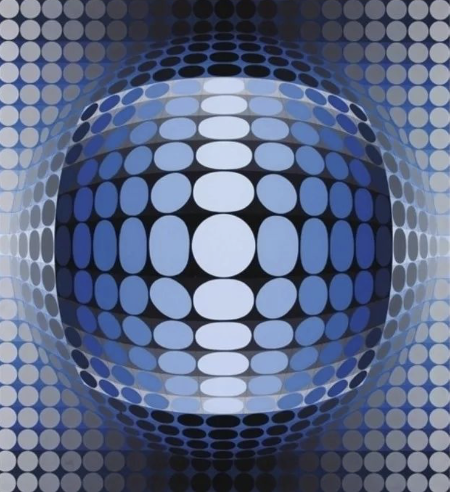
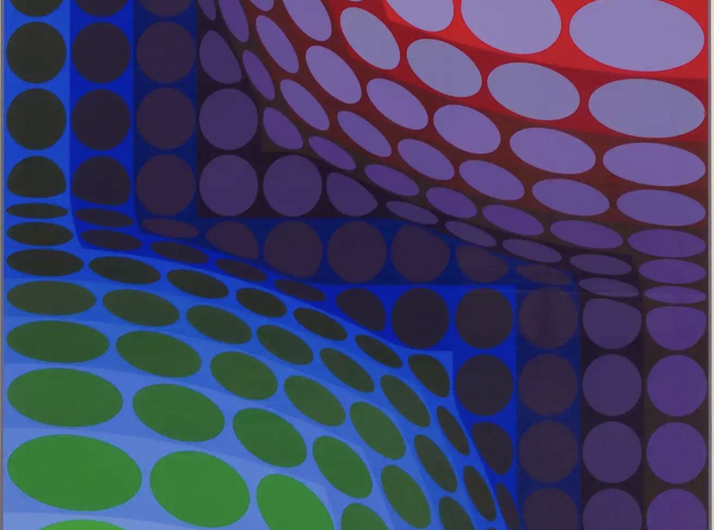
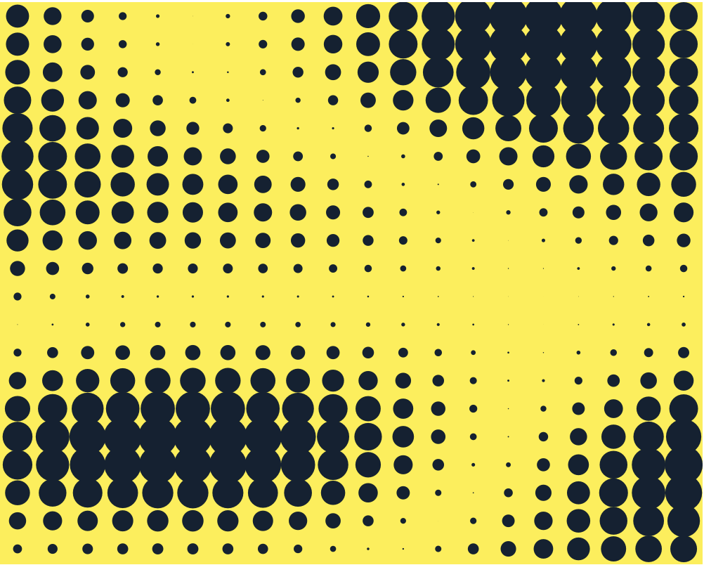

## Imaging Technique Inspiration: Geometric Abstract Art of Victor Vasarely

My inspiration comes from the artwork of Victor Vasarely. Through his art, I discovered that altering the size and color of geometric patterns can create a strong visual impact, making the imagery more intriguing. This insight is highly inspiring for my task. In the artwork "Wheels of Fortune," which is filled with colorful and predominantly circular geometric patterns, I believe that utilizing animation to smoothly and randomly scale these circles can create a similar three-dimensional visual effect.

## Coding Technique: Noise Generation
Noise generation techniques can be utilized to simulate the random dynamic changes in size and color of the circles in the artwork. This method ensures that the generated changes are random yet coherent, enriching the visual experience. By dynamically adjusting the input parameters of the noise function, such as modifying the time dimension or spatial position parameters, dynamic textures and color variations within the circles can be generated. This enhances the expressiveness of the animation, rendering the originally static artwork more visually impactful.
### Example：

[AnimationExample link](https://williamngan.github.io/react-pts-canvas-examples/build/)

[code link](https://github.com/williamngan/react-pts-canvas-examples/blob/d1d1a6acfcdd4bea777785ac4eb811a45c586069/example/src/PtsExamples.jsx#L60)

